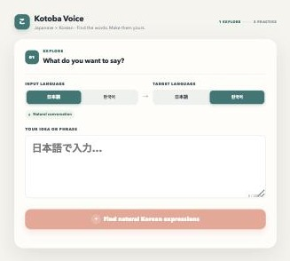
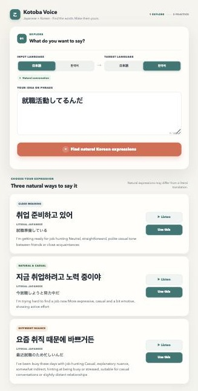
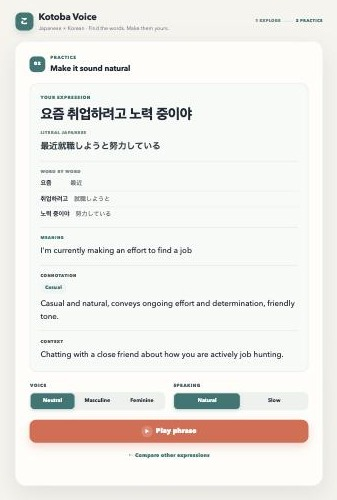
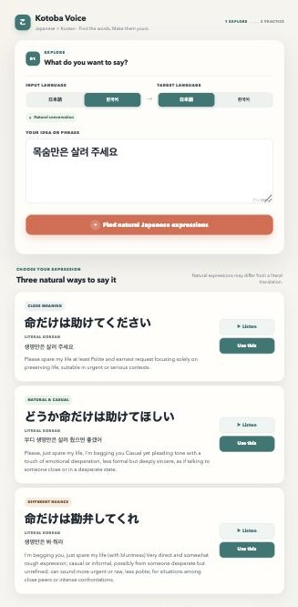
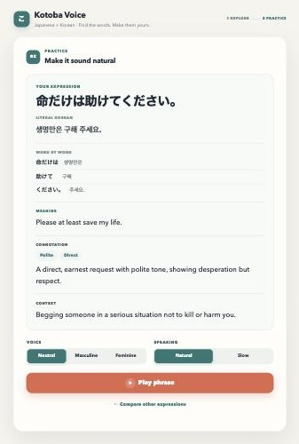
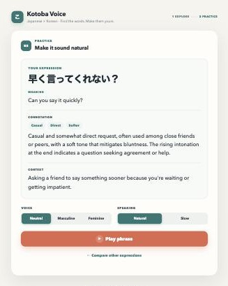

# Kotoba Voice — Japanese × Korean 利用マニュアル

このマニュアルは、日本語と韓国語を学ぶ学習者のための
**Kotoba Voice（日本語×韓国語版）** の使い方ガイドです。

実際にアプリを動かして撮影した画面（スクリーンショット）を使って、
画面の見方と使い方を説明します。

---

## 1. このアプリでできること

Kotoba Voice は、単に「これが正解の翻訳です」と1つだけ答えを出すアプリではありません。

このアプリの目的は、**自然な日本語・韓国語の言い方を比べながら学ぶこと**です。

同じ意味でも、場面や相手によって言い方は変わります。
そこでアプリは、1つの表現に対して次の3つのタイプの候補を出します。

- **Close meaning**（元の意味に近い言い方）
- **Natural & casual**（自然でカジュアルな言い方）
- **Different nuance**（少しニュアンスが違う言い方）

学習者はこの3つを見比べることで、
「同じことを言うにもいろいろな言い方がある」ということを実感できます。

---

## 2. 基本的な使い方

使い方はとてもシンプルです。

1. **Input Language（入力言語）** を選ぶ（日本語 または 한국어）
2. **Target Language（目標言語）** を選ぶ（日本語 または 한국어）
3. 言いたいフレーズを入力する
4. ボタンを押して、自然な言い方の候補を生成する

Input Language と Target Language が同じ場合（例：日本語→日本語）は、
翻訳ではなく、その文をそのまま発音練習するモードになります。

*Explore画面。上に Input Language（入力言語）と Target Language（目標言語）、
下にフレーズ入力欄があります。*

---

## 3. Explore画面の見方

Explore（探す）画面は、「自然にどう言えるか」を確認する画面です。

例として、日本語で

> 就職活動してるんだ

と入力し、Target Language を韓国語にして生成すると、
次のように3つの候補が表示されます。

*日本語→韓国語の例。3つの韓国語の候補が、それぞれ Literal Japanese（直訳的な日本語）と
英語の説明つきで表示されます。*

各候補カードには、次の情報があります。

- **カテゴリーラベル**（Close meaning / Natural & casual / Different nuance）
- **目標言語の表現**（大きな文字）
- **Literal Japanese / Literal Korean**（構造がわかる直訳）
- **英語の説明**（意味やニュアンス）
- **Listen**（音声を聞くボタン）
- **Use this**（この表現をPracticeで使うボタン）

**Listen** を押すと、その候補の発音をすぐに聞くことができます。

気に入った表現があれば、**Use this** を押しましょう。
Practice（練習）画面に移動します。

---

## 4. Practice画面の見方

Practice（練習）画面では、選んだ表現をより深く理解し、
声に出す練習ができます。

先ほどの候補の中から

> 요즘 취업하려고 노력 중이야
> （最近就職しようと努力している）

を選んだ場合、Practice画面は次のようになります。

*Practice画面の全体。上から順に、Your Expression、Literal Japanese、Word by Word、
Meaning、Connotation、Context、Voice、Speaking、Play phrase、Compare other expressions
が並んでいます。*

画面の各セクションの意味は以下の通りです。

| セクション | 内容 |
|---|---|
| **Your Expression** | 選んだ表現（練習する文） |
| **Literal Japanese / Literal Korean** | 構造が分かりやすい直訳 |
| **Word by Word** | 単語・チャンク単位の対応 |
| **Meaning** | 基本的な意味（英語） |
| **Connotation** | ニュアンス・気持ち・関係性など（英語） |
| **Context** | どんな場面で使うか（英語） |
| **Voice** | 声の種類（Neutral / Masculine / Feminine） |
| **Speaking** | 話す速さ（Natural / Slow） |
| **Play phrase** | 表現全体を音声で再生 |
| **Compare other expressions** | Exploreの候補一覧に戻る |

**Compare other expressions** を押しても、
Exploreで生成した候補は消えずに残っています。
気軽に他の候補と聞き比べることができます。

---

## 5. Literal Japanese / Literal Koreanとは何か

**Literal Japanese**（日本語のターゲット表現を選んだ場合は **Literal Korean**）は、
必ずしも一番自然な訳ではありません。

これは、**目標言語の表現がどんな構造になっているかを分かりやすくするための文**です。

たとえば、

> 요즘 취업하려고 노력 중이야
> Literal Japanese: 最近就職しようと努力している

のように、韓国語の語順や構造に近い形で日本語が示されます。
少し硬い言い方に見えることもありますが、それは自然さより
「構造の見やすさ」を優先しているためです。

---

## 6. Word by Wordとは何か

**Word by Word** は、日本語と韓国語の単語・意味のまとまり（チャンク）ごとの対応を
2列で示す機能です。

例：

| 韓国語 | 日本語 |
|---|---|
| 요즘 | 最近 |
| 취업하려고 | 就職しようと |
| 노력 중이야 | 努力している |

日本語と韓国語は文の構造がとても似ている言語なので、
この対応を見ると「どの部分がどの意味に当たるか」が直感的に分かります。

一語ずつバラバラに分解するのではなく、
意味のまとまり（チャンク）ごとに対応づけられているので、
実際の文の中でどう使われているかが理解しやすくなっています。

---

## 7. 逆方向（韓国語→日本語）の例

もちろん、韓国語から日本語に変換することもできます。

韓国語で

> 목숨만은 살려 주세요

と入力し、Target Language を日本語にすると、次のように表示されます。

*韓国語→日本語の例。日本語の候補には Literal Korean（構造が分かる韓国語）が
添えられています。*

ここで一番上の候補

> 命だけは助けてください

を選んで Use this を押すと、Practice画面は次のようになります。

*Practice画面（逆方向）。Literal Korean と Word by Word が、
日本語の文と韓国語の文の対応を示しています。*

このように、日本語⇄韓国語のどちらの方向でも、
同じ仕組みでLiteral表示とWord by Wordが使えます。

---

## 8. 同じ言語同士の場合（発音練習モード）

Input Language と Target Language を同じ言語にすると、
翻訳や言い換えは行われません。

たとえば日本語→日本語で

> 早く言ってくれない？

と入力すると、そのままの文が保存され、Practice画面が表示されます。

*同一言語（日本語→日本語）の例。入力した文がそのまま表示され、
Literal と Word by Word のセクションは表示されません。*

このモードでは、次のことが起こります。

- 入力した文が**そのまま**保存される（句読点や語尾も変わらない）
- **Literal Japanese / Literal Korean は表示されない**
- **Word by Word も表示されない**
- Meaning / Connotation / Context は通常通り表示される

これは、たとえば

> 痛い？
> 痛くないの？
> 痛くないよね？

のような、**語尾やイントネーションのニュアンスの違い**を練習したいときに便利です。

---

## 9. Meaning / Connotation / Context の役割

この3つは、いつも英語で表示されます。
英語の説明があることで、意味やニュアンスをより正確に理解できます。

- **Meaning** = 基本的な意味
  その表現がシンプルに何を意味しているか。

- **Connotation** = ニュアンス、丁寧さ、気持ち、関係性など
  カジュアルか丁寧か、直接的かやわらかいか、
  誰に対して使うか、どんな気持ちが込められているかなど。
  Casual・Direct・Polite のような短いバッジで
  要点が一目で分かるようになっています。

- **Context** = どういう場面で使うか
  実際にどんな状況・relationshipでその表現が使われるかの説明。

この3つを読むことで、単なる「意味」だけでなく、
**「いつ・誰に・どんな気持ちで使うか」** まで理解できます。

---

## 10. 音声の聞き方

Kotoba Voice では、表現を実際の音声で聞くことができます。

- **Listen**（Explore画面）
  各候補のすぐ横にあるボタン。その候補の発音をすぐに確認できます。

- **Play phrase**（Practice画面）
  選んだ表現をまとめて再生します。

音声の設定は、Practice画面で調整できます。

- **Voice（声の種類）**
  - Neutral（ニュートラル）
  - Masculine（男性的な声）
  - Feminine（女性的な声）

- **Speaking（話す速さ）**
  - Natural（自然な速さ）
  - Slow（ゆっくり）

Slow を選んでも、単語をぶつ切りにするような不自然な発音にはならず、
できるだけ自然なリズムを保ったまま、ゆっくり話してくれます。

---

## 11. 使い方のコツ

効果的に使うために、次のような順番がおすすめです。

1. **まず意味をつかむ**
   Meaning を読んで、大まかな意味を理解する。

2. **Literal / Word by Word で構造を見る**
   日本語と韓国語の文の構造がどう対応しているかを確認する。

3. **Connotation でニュアンスを見る**
   カジュアルか丁寧か、どんな気持ちが込められているかを確認する。

4. **音声を聞く**
   Listen や Play phrase で、実際の音とイントネーションを確認する。

5. **自分でも言ってみる**
   聞いた音声をまねして、声に出して練習してみる。

6. **3つの候補の違いを比べる**
   Close meaning・Natural & casual・Different nuance を聞き比べて、
   ニュアンスの違いを体感する。

---

## 12. 注意点

このアプリを使うときに、いくつか覚えておいてほしいことがあります。

- アプリが出す候補は、**自然でよく使われる言い方の一例**であり、
  「これだけが唯一の正解」というわけではありません。

- 言葉づかいは、**場面・相手との関係・年齢差などによって変わります**。
  同じ意味でも、状況によってふさわしい表現は変わります。

- このアプリは、**丸暗記するためのものではなく、比べて考えるためのもの**です。
  複数の候補やニュアンスの違いを見ながら、
  「どうしてこの言い方が選ばれているのか」を考えることが、
  言語学習にとって一番大切です。

---

## 短いまとめ

- Kotoba Voice は、日本語⇄韓国語の**自然な言い方を比べるためのアプリ**です。
- Explore で候補を探し、Practice でじっくり練習します。
- Literal は「構造を見るためのヒント」、Word by Word は「単語の対応」を示します。
- Meaning / Connotation / Context を読むことで、意味だけでなく気持ちや場面も理解できます。
- 音声を聞いて、実際に声に出して練習してみましょう。

楽しく、自然な日本語と韓国語を身につけていきましょう。
